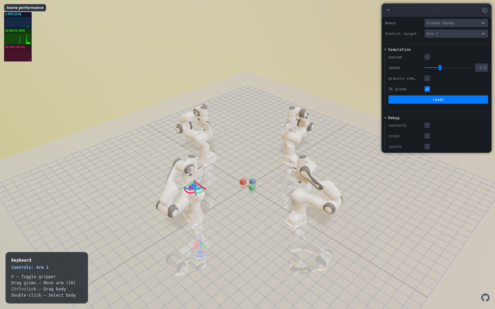
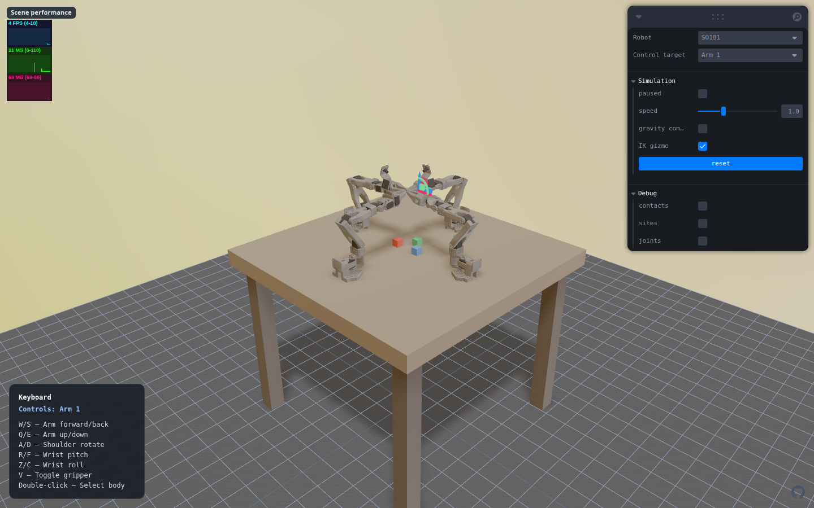
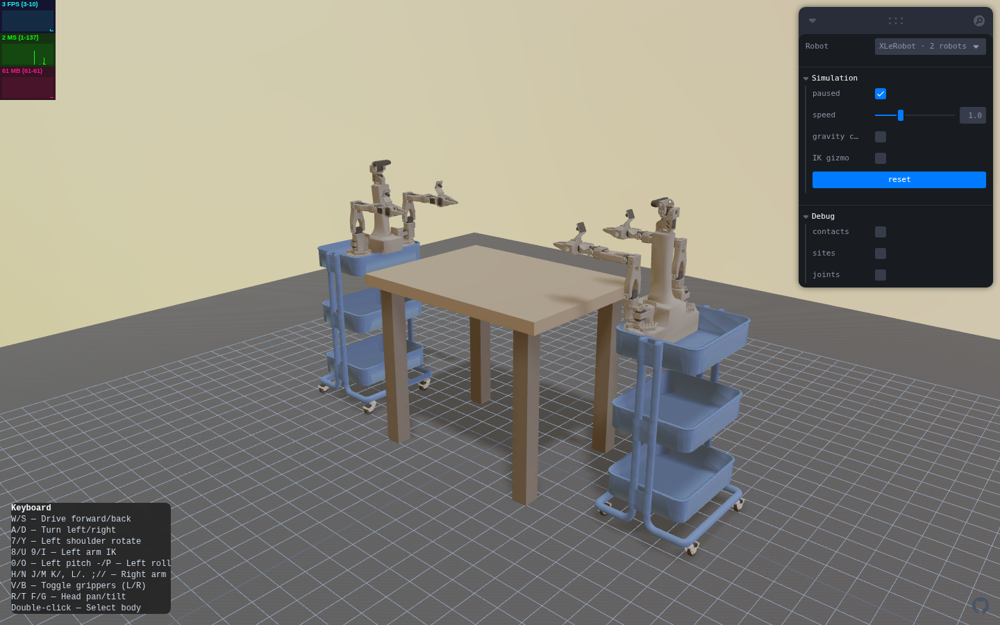
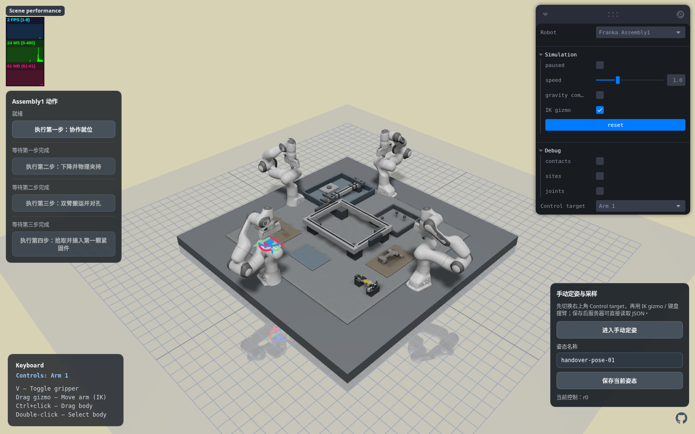
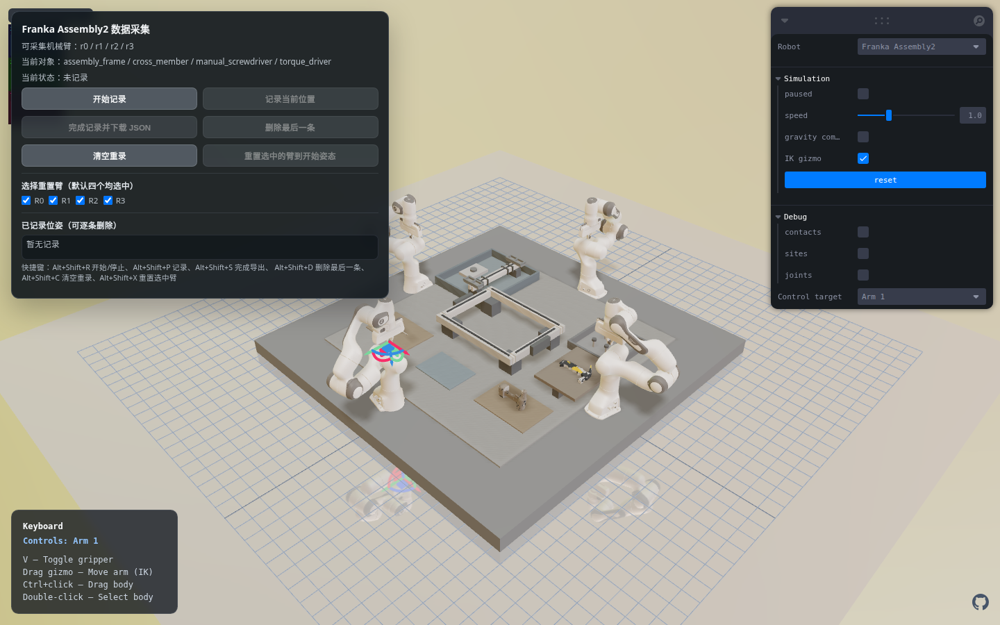
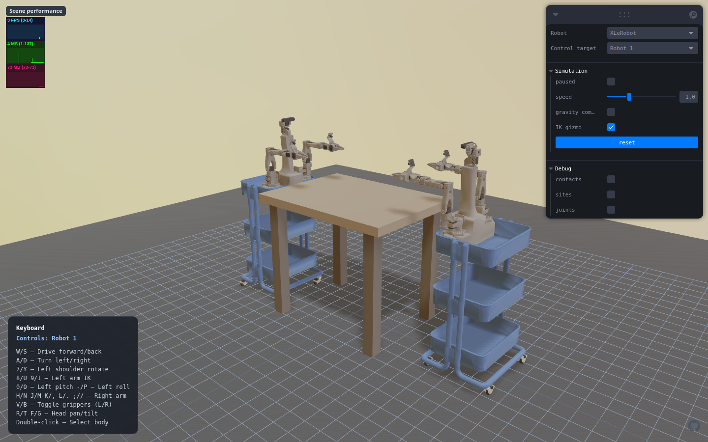
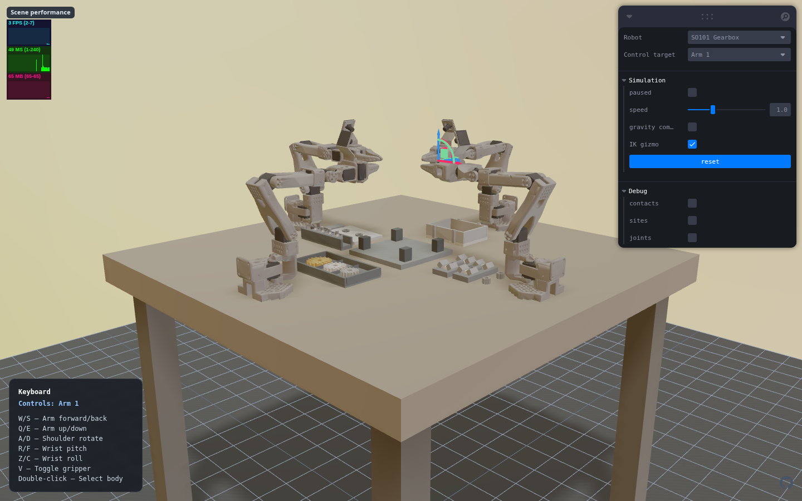
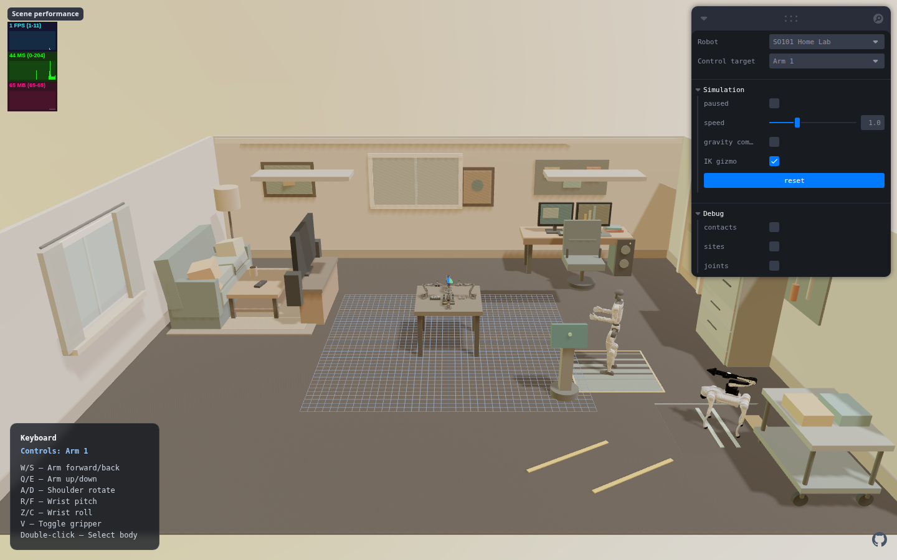
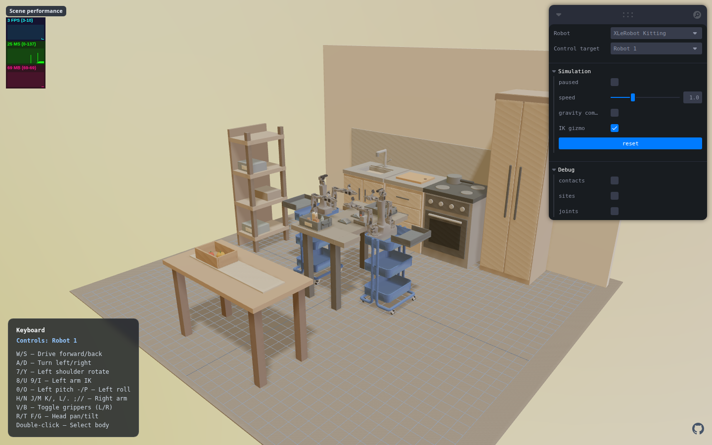

# Multi-Robot MuJoCo Web Example

An interactive browser simulation built with React, Three.js, `mujoco-react`, and MuJoCo WASM. The eight selectable scenes use independent physical robot instances—not visual-only clones.

[Open the live demo](https://shuaijun-liu.github.io/web-robot-example-0/)

## Verified scenes

| Franka Panda — 4 arms | SO101 — 4 arms | XLeRobot — 2 robots |
|---|---|---|
| [](artifacts/screenshots/franka.png) | [](artifacts/screenshots/so101.png) | [](artifacts/screenshots/xlerobot.png) |

### Franka Assembly1 and Assembly2 — fourth-scene variants

| Assembly1 — procedural physical tools | Assembly2 — converted RoboTwin tools |
|---|---|
| [](artifacts/screenshots/franka-assembly1.png) | [](artifacts/screenshots/franka-assembly2.png) |

These are two independently selectable implementations of the same static four-arm assembly staging area. Both use a `0.90 m` Panda ring, slotted aluminum frame, loose perforated cross-member, mounting plate, four fasteners, three tool stations, and handover pad. The four cross-member holes have named target sites that exactly match four recessed frame receivers at the planned installation pose. Assembly1 uses stable procedural geometry, including a grooved octagonal screwdriver with a flat collision proxy, detailed cordless torque driver, and a symmetric double-face hammer. Assembly2 keeps the same task geometry while using converted RoboTwin tool meshes with palette-baked color regions and simple collision proxies. Neither scene runs scripted task motion yet.

Both assembly scenes use real MuJoCo contact for grasping. Panda finger stiffness, damping, friction, and contact dimensionality are tuned so the screwdriver, torque driver, and hammer can survive an unsupported gravity hold; there is no proximity attachment, weld, magnetic grasp, or scripted object following. The XLeRobot rack also has a collision proxy covering its complete visible height, preventing the blue chassis from entering the arm-height table.

[](artifacts/screenshots/xlerobot-collision-stop.png)

### Collaborative task and room variants

| SO101 Gearbox — compact workcell | SO101 Home Lab — complete room | XLeRobot Kitting — mobile home task |
|---|---|---|
| [](artifacts/screenshots/so101-gearbox.png) | [](artifacts/screenshots/so101-home-lab.png) | [](artifacts/screenshots/xlerobot-kitting.png) |

`SO101 Gearbox` is the compact precision-assembly scene: four arms share one reachable housing, gear, shaft/spacer, cover, and press-pin workcell. `SO101 Home Lab` keeps that workcell unchanged while expanding the room to a south-open 10 m × 8.4 m layout. Its furniture remains outside a protected 1.6 m center radius and includes a detailed lounge, dual-screen office, static G1 display, static Go2-with-arm charging bay, maintenance cabinet, tool board, and service cart. `XLeRobot Kitting` places two independently drivable robots in a three-wall home kitchen for picking, scanning, handoff, and delivery tasks.

| Scene | Physical layout | Shared workspace |
|---|---|---|
| Franka Panda | Four 7-DOF arms at 90° intervals, facing the center | Three free-joint, graspable cubes |
| SO101 | Four 6-actuator arms at 90° intervals, facing the center | One table with a `0.800 m` top and three graspable cubes |
| XLeRobot | Two complete dual-arm mobile robots, facing one another | One four-leg table; its top is exactly `0.775 m`, matching the arm mounting height |
| Franka Assembly1 | Four 7-DOF arms on a larger `0.900 m` ring | Detailed procedural tools and explicit frame/cross-member interfaces |
| Franka Assembly2 | Same robot and task layout as Assembly1 | Multi-color RoboTwin tool meshes with stable collision proxies |
| SO101 Gearbox | Four SO101 arms in the original compact framing | Precision gearbox housing, gears, shafts, spacers, cover, and press pins |
| SO101 Home Lab | Same four-arm workcell in a detailed 10 m × 8.4 m room | Lounge, office, static G1, and static Go2-with-arm service zone |
| XLeRobot Kitting | Two mobile dual-arm robots in a three-wall home kitchen | Produce, packages, scanner, transfer tray, sink, stove, refrigerator, and storage |

The app starts running with the IK gizmo visible, matching the original interactive example. Use **Control target** to select an individual Franka/SO101 arm or one complete XLeRobot without reloading the shared scene.

## Run locally

Node.js 22 is recommended and is also used by the deployment workflow.

```bash
nvm use
npm ci
npm run dev
```

Open `http://localhost:3000`. The robot mesh files are loaded from their upstream model repositories, so the first visit may take longer than later cached visits.

## Controls

Keyboard and IK controls now work on every physical instance. Franka and SO101 offer `Arm 1–4`; XLeRobot offers `Robot 1–2`, with each selected robot retaining its original base, head, and two-arm key map. Only the selected control block is written, so switching targets preserves the other robots' poses.

| Key | Franka selected arm | SO101 selected arm | Selected XLeRobot |
|---|---|---|---|
| WASD | — | End-effector forward/back/up/down | Drive base |
| Q/E | — | End-effector left/right | — |
| R/F | — | Wrist pitch | Head pan |
| Z/C | — | Wrist roll | — |
| V | Toggle gripper | Toggle gripper | Left gripper |
| B | — | — | Right gripper |
| 7–0, Y/U/I/O | — | — | Left arm |
| H–L, N–/ | — | — | Right arm |

The panel also provides pause, speed, gravity compensation, reset, IK gizmo, contacts, sites, and joints controls. The gizmo follows only the selected Franka/SO101 TCP. Double-click selection and Ctrl/Cmd-click body dragging remain scene-wide. The top-left FPS/time/memory panels report whole-scene performance, not one robot.

## Implementation

The original layouts are centralized in [`src/sceneLayouts.js`](src/sceneLayouts.js), while the collaborative task layouts live in [`src/collaborativeSceneLayouts.js`](src/collaborativeSceneLayouts.js). The detailed SO101 room environment is isolated in [`src/so101HomeLabEnvironment.js`](src/so101HomeLabEnvironment.js), and both Franka assembly variants share their installation contract in [`src/frankaAssemblyLayouts.js`](src/frankaAssemblyLayouts.js). Each upstream robot is loaded as an MJCF model asset and inserted into a parent scene with MuJoCo `attach` elements and per-instance prefixes such as `r0_`, `r1_`, and so on. This keeps cross-references namespaced and produces independent physics for every instance.

Runtime selection and cameras are defined in [`src/configs.ts`](src/configs.ts). Target namespaces and control offsets are defined in [`src/controlTargets.js`](src/controlTargets.js); the selected-instance IK controller resolves explicit joint addresses and actuator indices instead of assuming the first block. Browser smoke tests reject a scene unless it contains exactly 4 roots in each Franka scene, 4 SO101 roots, or 2 XLeRobot roots.

## Verification

```bash
npm test
npx tsc --noEmit
npm run build
npm run build:pages
```

For reproducible screenshots, run the Vite server and then:

```bash
npm run capture:scenes
npm run verify:controls
```

`verify:controls` selects every controllable instance, including all four arms in both SO101 task scenes, then checks that keyboard and IK input change only the selected actuator block. G1 and Go2 in Home Lab are intentionally static room assets and do not add control targets. `FRANKA_ASSET_DIR` and `XLEROBOT_ASSET_DIR` can point both browser scripts at local upstream assets to avoid repeated network downloads. The offline compiler helper is available as `node scripts/validate-mjcf.mjs <scene> <asset-directory>`. Set `GRASP_REPORT=1` and optionally `GRASP_TOOL=manual_screwdriver|torque_driver|hammer` to run an unsupported physical gravity-hold check for either Franka assembly scene.

## GitHub Pages

Every push to `main` runs [`.github/workflows/pages.yml`](.github/workflows/pages.yml), executes tests and type checking, builds with the `/web-robot-example-0/` base path, and deploys the generated site through GitHub Pages Actions.

## Model sources

- Franka Panda: [MuJoCo Menagerie](https://github.com/google-deepmind/mujoco_menagerie/tree/main/franka_emika_panda)
- SO101 and XLeRobot: [MuJoCo-GS-Web](https://github.com/Vector-Wangel/MuJoCo-GS-Web/tree/main/assets/robots/xlerobot)
- Assembly2 screwdriver, drill, and hammer: [RoboTwin](https://github.com/RoboTwin-Platform/RoboTwin) (MIT; converted locally from selected GLB assets)

Assembly2 ships only the three selected converted tool meshes, their palette partitions, and source base-color textures. Exact source paths, licenses, and conversion details are recorded in [`public/assets/franka-assembly2/THIRD_PARTY_NOTICES.md`](public/assets/franka-assembly2/THIRD_PARTY_NOTICES.md).
