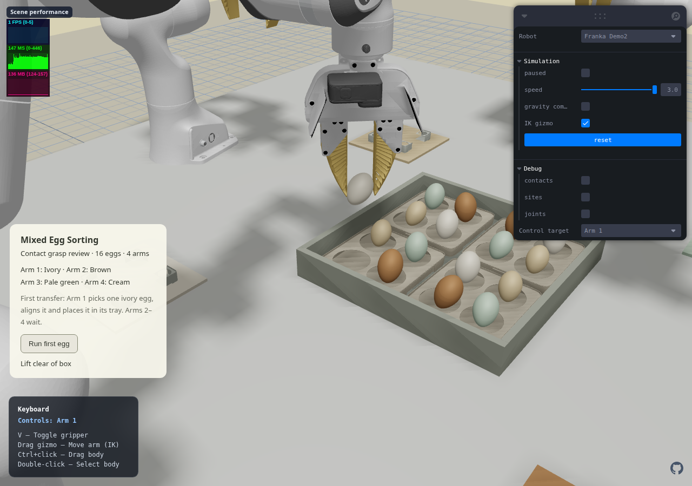
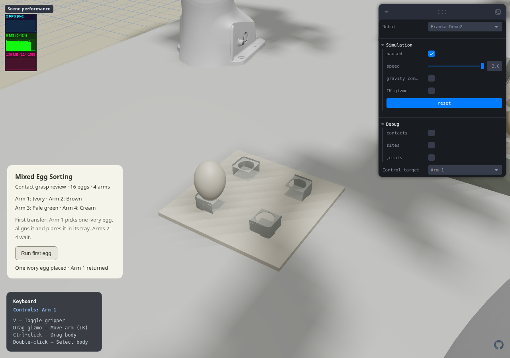

# Demo2 — first physical egg transfer

## Release boundary

The four-arm static workcell was committed and pushed as `49f9be7`. GitHub Pages run [34175093620](https://github.com/Shuaijun-LIU/web-robot-example-0/actions/runs/34175093620) succeeded.

This follow-up implements one Arm 1 transfer, not completed four-arm sorting. Demo1 / Assembly1 remain at their accepted asset/controller baseline; the default page remains Demo1.

## Implemented motion

1. Approach the first ivory egg with a 63 mm opening, on a diagonal pinch line that clears neighboring eggs.
2. Descend, close and verify actual contact from both fingers.
3. Lift approximately 130 mm and carry above the southwest ivory tray.
4. Rotate the wrist to correct the measured carried egg tilt in free space.
5. Descend to the first pocket and confirm that the tray supports the egg before release.
6. Open to approximately 51 mm while holding the wrist still. This leaves about 9 mm total clearance around the 42 mm egg without sweeping a tilted finger into the tray rim.
7. Withdraw vertically while opening fully, return Arm 1 home, then verify stable support. Arms 2–4 remain at home.

Only robot actuators are commanded. No runtime egg pose/velocity writes, welds, proximity attachment or invisible grip supports are used. The controller owns keyboard/IK/object dragging during playback; Reset cancels it. Paths are solved offline, with controls sampled every 2 ms independently of the display frame rate.

## Geometry and solver changes

- The same benchmark egg shell and UMI fingers are retained. Source egg-holder inserts are lower so that the fingers can reach the egg's middle.
- Destination holders are four source-derived pocket sections, scaled around the existing holes at X/Y 0.35 and Z 0.6, with 84 mm pocket spacing. Visual and convex collision parts receive identical transforms. The smaller openings support the lower end of the egg and leave clearance for the tilted gripper.
- Initial poses are generated by 200 seconds of passive contact settling, not runtime object animation.
- Demo2 explicitly enables multi-point convex contact and 10 no-slip solver iterations. Native MuJoCo 3.12.0 initially passed a trajectory which the browser's 3.3.8 engine dropped. Native 3.3.7 reproduced that slip; the browser engine remains the required acceptance test. The shared engine version is unchanged.
- The solver option follows [MuJoCo's official guidance on preventing slip](https://mujoco.readthedocs.io/en/3.3.5/modeling.html#preventing-slip). It addresses soft-contact tangential creep; it is not an object attachment.

## Verified evidence

Native MuJoCo 3.3.7 full trajectory:

| Measurement | Result |
| --- | ---: |
| Egg lift | 129.6 mm |
| Maximum single-jaw normal force | 1.43 N |
| Maximum finger/egg contact penetration | 0.251 mm |
| Maximum non-permitted penetration | below 0.001 mm numerical residue |
| Longest carried contact loss | 0 s |
| Maximum neighboring egg displacement | 0.59 mm |
| Final tilt | 0.17 degrees |
| Final cell-center error | 0.09 mm |
| Release opening | 50.96 mm |
| Post-release verification drift | 0.06 mm |

The WASM 3.3.8 replay passes every physics-tick collision/neighbor check and all phase gates, with 129.6 mm lift, 0.17-degree final tilt and actual tray support after both fingers release. See [native report](../../artifacts/reports/demo2-first-egg-native.json) and [WASM report](../../artifacts/reports/demo2-first-egg-wasm.json).

The full Node suite passes 222/222; TypeScript and the production build pass. Actual browser playback completed with 0.17-degree final tilt and zero physics warnings. All four arms' independent keyboard/gripper and IK controls pass, and switching back to Demo1 still exposes its Play button. The carrying-state Reset regression passes with a lossless state-transition log: [Reset report](../../artifacts/reports/demo2-egg-reset-browser.json).

The first Reset test exposed a short stale-control window between native physics reset and the React reset effect. The controller now detects physics-clock rollback before writing actuator targets. The regression records each diagnostic assignment synchronously, rather than trusting a 200 ms sampled display log.

The earlier `demo2-first-egg-error.png` is retained as a failed pre-fix WASM slip diagnostic, not a current successful result.

## Visual review

[Browser playback report](../../artifacts/reports/demo2-first-egg-browser.json)





## Reproduction

Asset conversion uses the dependencies in the asset README; the current passive settle was generated with native MuJoCo 3.12.0. For the trajectory builder/native acceptance, use `mujoco==3.3.7`, NumPy and trimesh. Version 3.3.7 is a close native comparison, not a claim that it is identical to the browser's 3.3.8 build.

```sh
python scripts/solve-egg-transfer.py --export
python test/egg-transfer-physics.py
node --test test/egg-transfer.test.mjs test/egg-transfer-wasm.test.mjs
npm test
npx tsc --noEmit
npx vite build --base=/web-robot-example-0/
npx vite preview --base=/web-robot-example-0/ --host 127.0.0.1 --port 4175
SCENE_URL=http://127.0.0.1:4175/web-robot-example-0/ node scripts/verify-egg-transfer.mjs
```

The browser verifier also supports `EGG_PLAY_ONLY=1` for complete playback/screenshots and `EGG_RESET_ONLY=1` for the isolated carrying-state Reset check. It uses CPU SwiftShader rendering.

## Next milestones

- Correct an egg that is tilted **after placement**, with actual contact-driven regrasp/reseat. Current wrist correction occurs before release and does not claim this milestone.
- Generalize grasp/seat targets to the other appearance classes and occupied neighboring tray cells.
- Validate two-arm conflicting approaches, then add shared-space reservations and four-arm concurrent sorting.
- Integrate continuous Demo2 playback only after those physical gates pass.
