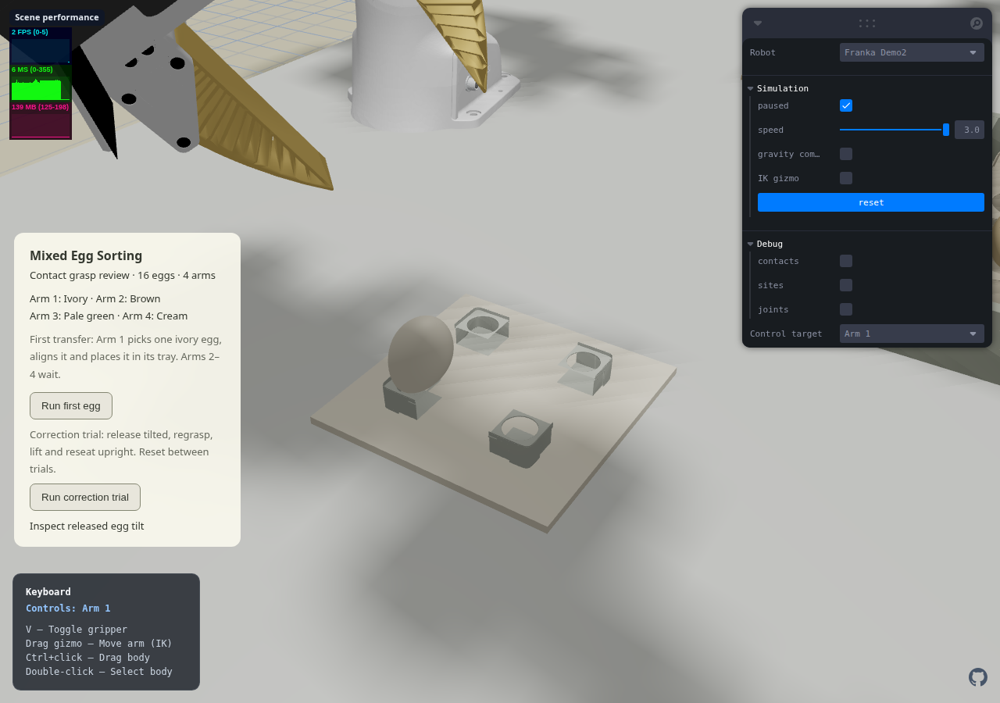
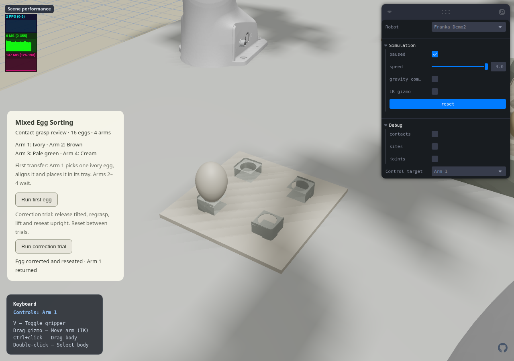

# Demo2 post-placement regrasp — design and progress

User approved continuing after accepting the `f6d45ac` single-egg baseline.

## Scope

Add an isolated correction trial to Demo2. Preserve `Run first egg`, its motion asset, all scene geometry/physics settings and Demo1 / Assembly1. No commit or push is requested in this turn.

The trial replays the successful pickup/transfer, releases an egg with an actuator-driven wrist withdrawal that leaves a measurable tilt, and retreats. Only after actual finger release and tray support are observed does it detect the bad angle, regrasp, lift, rotate upright, reseat, release and return home. Never assign egg poses or attach objects. Use the existing benchmark geometry.

Acceptance: initial released tilt >20 degrees; two distinct finger contacts before relift; relift >60 mm; final supported release with tilt <20 degrees; no forbidden penetration >0.1 mm or finger/egg penetration >1 mm; neighbors move <2 mm. Final correction should visibly improve orientation, not merely pass a relaxed check. Keep the original successful transfer regression.

## Execution checklist

- [x] Red physical test: a tilted, fully released egg must be grasped again and seated upright.
- [x] Implement/verify a separate native trajectory using the existing planner; export only a physically passing result.
- [x] Add schema/gate tests, isolated trial selection and measured tilt diagnostics to the existing controller.
- [x] Replay in the actual browser WASM engine, test the UI/Reset, capture before/after screenshots.
- [x] Record measured results and unresolved limits; preserve the accepted baseline.

## Implementation boundary

`Run correction trial` is a separate 20-phase checked recipe. `Run first egg` retains its original 11 phases and motion asset. Trial download failure does not prevent running the accepted recipe. Reset is required between trials.

The fixture deliberately withdraws the wrist early during the first release, physically leaving a tilted egg. It then completely clears the egg and verifies actual tray support, no finger contact, low velocity and tilt above 20 degrees. Before regrasp, the measured pose must be within 4 mm / 5 degrees of the checked inspection pose. The controller stops outside that envelope instead of replaying a grasp into an unverified position. This is a controlled post-placement correction demonstration, not an arbitrary-pose online recovery policy.

The second grasp uses both real finger contacts. It relifts the egg, corrects its orientation in free space, lowers to tray support, opens with the wrist stationary, withdraws and returns home. No scene geometry, contact properties, force limits, object masses or accepted first-egg trajectories changed in this increment.

## Physical verification

Native MuJoCo 3.3.7 and actual web-engine WASM 3.3.8 both pass. Tests inspect collision and neighbor displacement at every physics tick, in addition to phase completion gates.

| Measurement | Native result |
| --- | ---: |
| Fully released initial tilt | 24.381 degrees |
| Second-grasp lift | 99.47 mm |
| Final supported tilt | 0.239 degrees |
| Maximum finger/egg penetration | 0.276 mm |
| Maximum non-permitted penetration | below 0.001 mm numerical residue |
| Maximum neighboring egg displacement | 0.823 mm |
| Maximum single-jaw normal force | 1.75 N |
| Longest carried contact loss | 0 s |
| Final cell-center error | 0.108 mm |

[Native evidence](../../artifacts/reports/demo2-egg-reseat-native.json) · [WASM replay](../../artifacts/reports/demo2-egg-reseat-wasm.json)

## Reproduction

Use the existing trajectory dependencies with native `mujoco==3.3.7`, NumPy and trimesh; final acceptance also runs in the pinned web engine.

```sh
python test/egg-reseat-physics.py
python scripts/solve-egg-reseat.py --export
node --test test/egg-reseat.test.mjs test/egg-transfer-wasm.test.mjs
npx tsc --noEmit
npx vite build --base=/web-robot-example-0/
npx vite preview --base=/web-robot-example-0/ --host 127.0.0.1 --port 4175
EGG_TRIAL=reseat EGG_PLAY_ONLY=1 SCENE_URL=http://127.0.0.1:4175/web-robot-example-0/ node scripts/verify-egg-transfer.mjs
```

The browser verifier uses CPU SwiftShader and saves actual before/after viewport images.

## Code verification and review

- Test-first work demonstrated failures for the missing correction implementation, missing tilt gate, missing pose-envelope check and a mislabeled v1 recipe; all were made passing without relaxing the original grasp/contact criteria.
- The independent read-only code review found that a v1 recipe could be mislabeled `program: reseat`. Validation now rejects incompatible schema/program combinations, and each download endpoint requires its own schema version.
- Full Node regression: **226/226 passed**, including both real-WASM physical trajectories. TypeScript and the production Pages-path build passed. Existing bundle-size and upstream WASM browser-externalization warnings remain unchanged.
- The accepted `first-egg-motion.json`, `scene.xml` and `panda.xml` are byte-for-byte unchanged from `f6d45ac`.

## Visual review

Actual browser playback completed all 20 phases with **24.385 → 0.241 degrees** tilt, **99.55 mm** relift measured from the fully released inspection state, actual bilateral regrasp and no finger contact after supported release. The final cell-center error was **0.109 mm**. There were no browser exceptions, no error-state transitions and zero MuJoCo warnings. The carrying-state Reset regression also passes on the original button with the updated controller/build.

[Browser playback and contact history](../../artifacts/reports/demo2-egg-reseat-browser.json) · [Reset regression](../../artifacts/reports/demo2-first-egg-reset-browser.json)





## Handoff

Open the local built page, select **Franka Demo2**, then **Run correction trial**. The earlier **Run first egg** remains separate; use Reset before starting either again. This increment is local and has not been committed or pushed.

Next: extend validated grasp/place targets to a second class and verify two-arm shared-space conflict handling before four-arm concurrent sorting. Demo1 / Assembly1 remain frozen; hardware gripper qualification is separate from this simulation increment.
