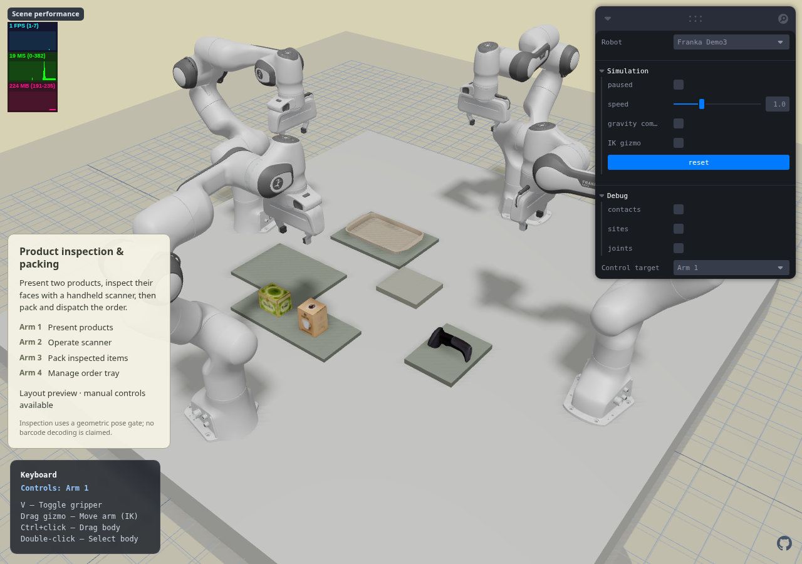
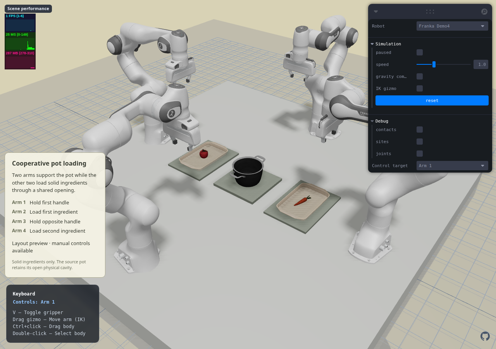

# Cooperative workcells — 2026-10-07

## Requested delivery order

Demo2 optimization was committed and pushed first as `0c18da6` after a fresh
238/238 test run, type check and production build. GitHub's matching build and
artifact upload also passed; deployment status is checked separately.
New work is on `feat/franka-scan-and-pot`, not in that published release.

Design/acceptance: [spec](../superpowers/specs/2026-10-07-cooperative-workcells.md).
Implementation: [plan](../superpowers/plans/2026-10-07-cooperative-workcells.md).

## Stage 1 — physical layouts

Added two separate pages, keeping Demo1 as default:

- **Franka Demo3:** RoboTwin scanner, tea box, coffee box and tray, with incoming,
  inspection/handoff, packing and dispatch regions.
- **Franka Demo4:** RoboCasa/Lightwheel Pot054, a source carrot and tomato, and
  two preparation trays. Opposite arms are assigned the handles; the other two
  own the ingredient areas. Pot uses 65% uniform scale and all 38 original
  convex collision pieces; it is not a solid hull or a newly modeled pot.

The four Panda roots are mounted at tabletop height and retain separate manual
IK/keyboard control targets. Objects are free bodies with gravity and physical
contacts. This stage is explicitly a **layout preview**, not completed automatic
motion; later stages must pass the full grasp/transfer/load gates.

### Evidence

- Native MuJoCo 3.3.7: both scenes compile with 32 actuators and four TCPs.
- Five-second idle test: no meaningful robot penetration (maximum numeric
  residual 2.6e-18 m); all task objects drift less than 0.003 mm in the final
  second of the native check.
- Collision/visual bounding-box difference: 0.45–2.72 mm depending on the
  benchmark's existing approximation; recorded per asset, not assumed exact.
- A free 20 mm sphere drops through the actual pot opening and rests on the
  inner floor 21.84 mm above the pot origin, proving the collision cavity is open.
- Browser loading/switching/Reset test and screenshots exercise actual WASM.
- Early screenshot exposed an upstream renderer limitation: OBJ UVs and
  texture maps were not displayed. A failing UV-retention check reproduced
  export loss, and a scene-scoped texture adapter now supplies the source maps
  without changing geometry, physics or old scenes. A separate test verifies
  per-face UV seams and restoration on cleanup.

Reports: `artifacts/reports/cooperative-assets-native.json`,
`artifacts/reports/cooperative-browser-layouts.json`.

## Next gates

1. Actuator-only runtime with contact, release/support and failure checks.
2. Product presentation → scanner pose → supported handoff → packing/dispatch.
3. Bilateral pot grasp → cooperative lift/hold → alternating loading → set-down.
4. Full native/WASM replay, rendered critical-stage inspection and old-scene regression.
