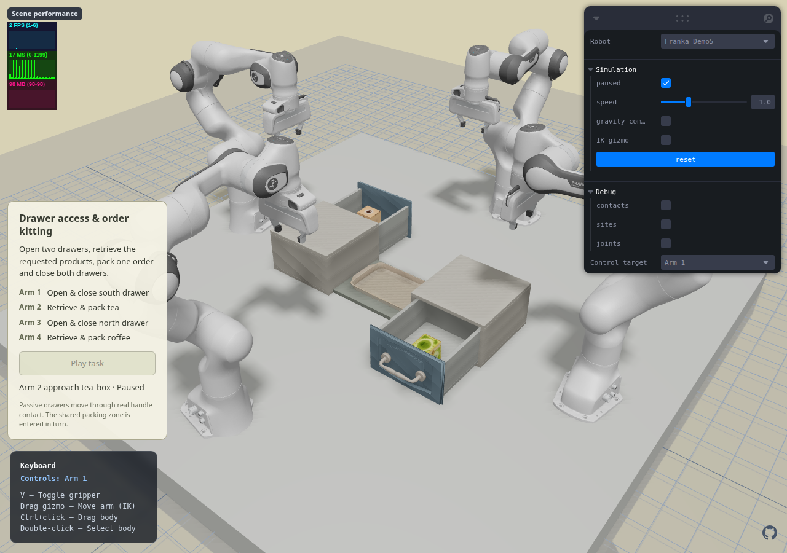
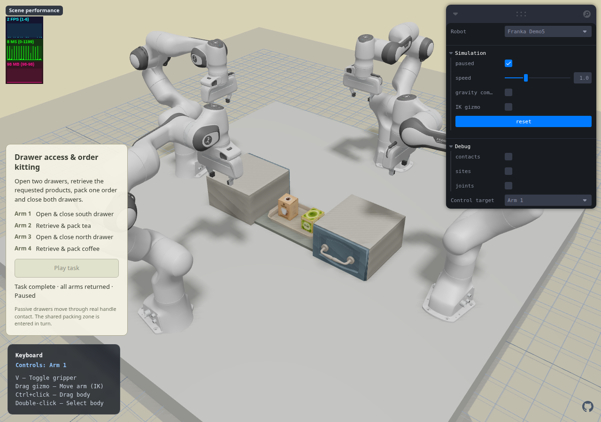

# Franka Demo5 — drawer access and order kitting

## Scope and design

User approved starting the next demo after the [benchmark task proposals](../../project/benchmark-task-proposals-2026-10-07.md).
This increment implements candidate A first, as a new `Franka Demo5` page.
Existing scenes, motion assets and the Demo1 default are preserved.

- [Design](../superpowers/specs/2026-10-07-drawer-kitting-design.md)
- [Implementation plan](../superpowers/plans/2026-10-07-drawer-kitting.md)
- [Source attribution](../../public/assets/franka-cooperative/README.md)
- [Fixture manifest](../../public/assets/franka-cooperative/drawer-manifest.json)

Two 280 × 300 × 170 mm drawers sit at X=±320 mm and face opposite directions.
Arm 1 operates the south-facing drawer, Arm 3 the north-facing drawer. Arms 2/4
retrieve tea/coffee and fill separate slots of one central order tray. Opening
and closing use paired motion; the shared packing region is entered in turn.
This demonstrates physical articulation plus coordination, not a claim that
four arms are intrinsically necessary for the task.

## Assets and physical model

Housing/inner-box topology and dimensions reuse RoboCasa `Drawer`; front panel
is `CabinetDoorPanel029`, handle is `CabinetHandle001`. Source OBJ textures and
collision primitives are retained. The handle is rotated into a horizontal
orientation; the panel is resized using the same visual/collision transform.
Robot and product meshes are the already integrated benchmark assets.

The two slides are passive: no drawer motor, spring closure, weld, object
attachment or scripted object pose. Opening requires actual bilateral finger
contact followed by arm motion. The products ride inside through friction,
then are physically grasped and lifted. There are exactly 32 robot actuators.

The tea box starts turned 90° so its narrow dimension fits the Panda fingers
when closing across the drawer width. This is an initial placement change,
not resizing the product or changing its collision model.

## Motion decisions and observed failures

1. A downward handle grasp caused the palm to hit the cabinet top before the
   fingers reached the bar. The physical grasp gate rejected the motion.
2. A fully horizontal wrist ran into a joint-limit branch on the approach.
   An offline orientation/collision probe selected an outward pitch of 0.85 rad
   and the equivalent 180° jaw-symmetry branch, avoiding that wrist wrap.
3. A vertical descent with the tilted fingers caught one side of the handle.
   Entry/release now follow the gripper approach axis, keeping the bar inside
   the open jaw corridor. Force limits and contact requirements are unchanged.
4. Original tea orientation required a depth-wise grasp; the palm contacted
   the tall drawer front. Rotate the source box at initialization and grip
   across the width. Both product approaches use the wrist-equivalent branch
   that stays away from joint 7 limits.
5. Product transport lifts above the cabinet before entering the central
   tray, and only one packing arm owns that region at a time.
6. Re-solving the closing approach directly from HOME selected a different
   elbow branch that reached a joint limit halfway through the push. Closing
   now re-enters via the verified opening withdrawal posture; the physical
   handle pose is unchanged and the whole closing path stays reachable.

## New checks

- Optional initial fixture-joint conditions reject manually moved drawers;
  playback never snaps them back to a precomputed position.
- `joint-range` observes actual joint position/speed for opening and closing.
- Optional X bounds on `inside` distinguish the two order slots. Existing
  scan/pot programs keep their original gate semantics.
- Bilateral handle/product contact, support before release, gripper clearance
  after release, and HOME gates reuse the proven cooperative runtime.

## Verification log

- Original baseline: 255/255 Node tests passed before implementation.
- New fixture/gate and existing gate checks: 10/10 passed after RED→GREEN.
- Complete motion is 49 phases / 96.6 s of simulation time, excluding initial
  passive settling and browser wall-clock/render overhead.

| Check | Result | Unintended robot penetration | Peak intended contact penetration |
| --- | --- | --- | --- |
| [Native MuJoCo 3.3.7](../../artifacts/reports/cooperative-drawer-native.json) | Complete | 0 mm | 0.371 mm |
| [WASM MuJoCo 3.3.8](../../artifacts/reports/cooperative-drawer-wasm.json) | Complete | 0 mm | 0.368 mm |
| [WASM, additional 3 s passive settling](../../artifacts/reports/cooperative-drawer-wasm-extra-settle-1500.json) | Complete | 0 mm | 0.369 mm |
| [Actual browser provider](../../artifacts/reports/cooperative-drawer-browser.json) | Complete; Pause/Reset/switch pass | 0 mm | 0.370 mm |

Both boxes rest in their assigned tray slots with real support and no finger
contact. Native final slides are 0.519/0.497 mm from zero. All four robots are
home. Browser has zero page errors and zero MuJoCo warnings; switching
Demo5 → Demo3 → Demo5 succeeds after Reset. The browser runner advances the
actual provider's fixed physics steps while rendering selected milestones;
this is physical execution, not a claim of real-time performance.

Independent read-only code review found no Critical/Important issues. Its one
Minor finding was repaired: opening assertions now match observations to each
named slide gate, rather than searching twice for any opened drawer. The
strengthened six-test Demo5 suite passes. No dynamics thresholds were relaxed.

Expanded full-suite regression passes **261/261** (308.8 s). The strengthened
six-test Demo5 suite and delayed-start replay also pass after the review fix.
TypeScript and the final production build pass. Existing large-bundle and
MuJoCo `module` externalization warnings remain non-fatal. `git diff --check`
passes; previous scene XML and motion files have no changes.

### Rendered evidence

- [Initial closed drawers](../../artifacts/screenshots/drawer-layout-2026-10-07.png)
- [Both drawers open](../../artifacts/screenshots/drawer-open-2026-10-07.png)
- [Tea packed, coffee awaiting retrieval](../../artifacts/screenshots/drawer-packing-2026-10-07.png)
- [Both products packed, drawers closed, arms HOME](../../artifacts/screenshots/drawer-complete-2026-10-07.png)





## Delivery and local preview

Choose **Franka Demo5** in the existing page selector and click **Play task**.
The existing local development server is `http://127.0.0.1:4185/`; on another
computer this address requires the user's existing port-forwarding setup.
Pause, Reset and independent arm manual targets remain available. After
manually moving objects, drawers or arms, Reset is required before playback.

Existing scene XML/motion assets remain unchanged. This increment remains
local and uncommitted on `feat/franka-scan-and-pot`; it is **not deployed**.
The earlier failed native diagnostic was moved into the ignored implementation
ledger folder, not erased; its causes and resolutions are listed above.

## Reproduction

```bash
uv run --with trimesh --with pillow --with numpy python scripts/build-drawer-assets.py --robocasa PATH_TO_ROBOCASA_REPO
uv run --with 'mujoco==3.3.7' --with numpy python scripts/solve-drawer-task.py
node --test test/drawer-gates.test.mjs test/drawer-workcell.test.mjs test/drawer-wasm.test.mjs
node scripts/verify-drawer-browser.mjs
```

Browser verification uses software rendering and a local dev server at the
URL selected by `SCENE_URL` (default `http://127.0.0.1:4185/`). It runs the
provider's actual fixed physics steps, not object-position animation.

## Benchmark follow-up

This increment is a deterministic, physically checked seed demonstration.
Seeded drawer/target layouts, synchronized RGB/action export, model training,
single-/two-/four-arm comparisons and other two candidate scenes remain future
work. Preserve the successful playback while adding those independently.
