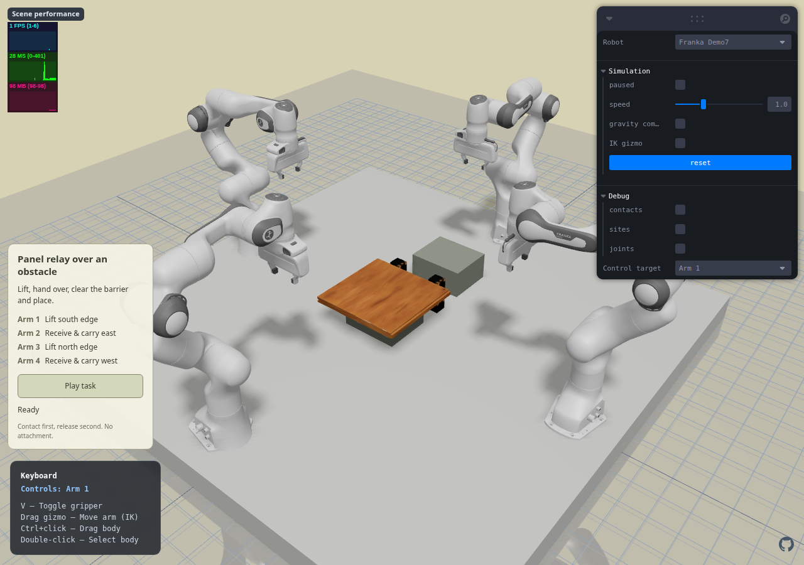
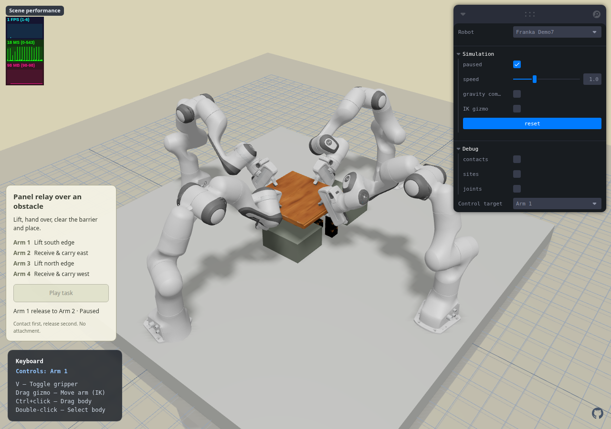
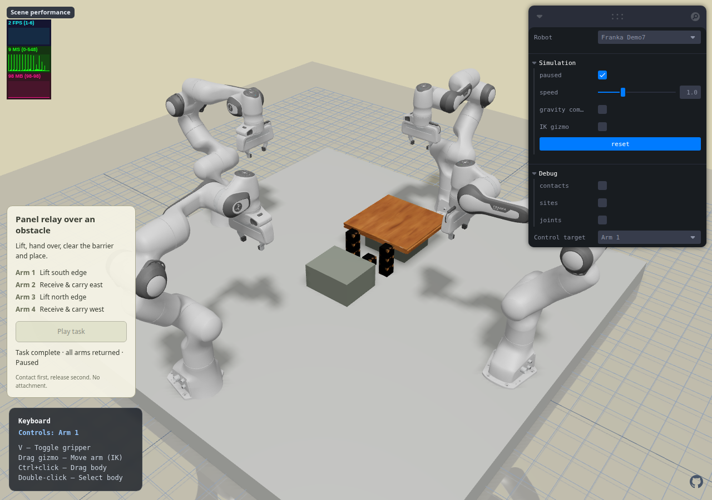

# Franka Demo7 — 木板跨障交接

## 交付范围与发布状态

- 本轮首先提交并推送了已验收的 Demo6：`5045be3`。两条 Pages 工作流 `37627829532`、`37627828409` 均成功，线上 `insertion-motion.json` 与本地逐字节一致。
- 新增独立英文页面 **Franka Demo7**，选择后点击 **Play task**。沿用四臂独立手动控制、Pause、Reset 和页面切换。Demo1 默认入口及其他任务轨迹、机器人资产不变。
- Demo7 初次在 `feat/franka-panel-relay` 本地交付。用户随后明确要求“优化后推送 demo7”，本次在保留真实接触条件下优化并发布；它不是此前 `5045be3` 的内容。
- 优化后的完整动作已通过原生及 WASM 回放、额外 3 秒静置后的重放和最终浏览器完整播放。277/277 项测试、TypeScript、生产构建均通过；独立复核发现的可见接触间隙已修正并重新验收。

## 场景和实际动作

四台 Panda 位于半径 **0.85 m** 的圆周，基座与桌面同高（Z=0.10 m）。木板在南侧起始支撑上；北侧是独立的接收支撑。两个支撑顶面均为 Z=0.22 m，中心 Y 分别为 -0.05、0.38 m。

| 机械臂 | 角色与实际夹持位置（板局部坐标，米） |
|---|---|
| Arm 1，南 | 初始抬升、支撑南边：`[0,-0.16,0.013]` |
| Arm 3，北 | 初始抬升、支撑北边：`[0,0.16,0.013]` |
| Arm 2，东 | 接收东边并搬运：`[0.16,0,0.013]` |
| Arm 4，西 | 接收西边并搬运：`[-0.17,0,0.013]` |

夹爪进场方向为水平向内、向下倾斜 35°，夹住木板厚度方向。不是在木板上新建把手或限位夹具。优化后完整动作 **22 阶段、48.9 秒仿真时间**（初版 26 阶段、59.9 秒）：

1. Arms 1/3 同步进场、闭合，分别确认两个手指真实接触。
2. 同步抬板约 160 mm，移到中心交接位置。
3. Arms 2/4 同步接近、进入东西侧夹持位置，随后分别闭合并验证。**两个接收臂都夹稳后**，才允许原持有臂放开。
4. Arm 1 松开，再由 Arm 3 松开；支撑数量仍按 4→3→2 切换。两个空夹爪随后同步向外上方退让、回初始位。
5. Arms 2/4 共同越过障碍，在北侧支撑上下降放板。根据真实支撑接触补充小幅下降，确认放稳。
6. 两臂松爪、沿进场反方向退出，再回初始位。终态要求板与接收台接触、无手指接触、四臂 HOME。

运动文件只存机械臂执行器目标、开合量及检查条件。自由木板全程由重力、接触和摩擦驱动；没有焊接、磁吸、物体位姿播放或物体外力补偿。Panda 原有有限夹爪力保持不变。

### 本轮优化选择

- 接收臂同时接近/进场，节省 5.5 秒；原持有臂松爪后同步撤离/归位，再节省 5.5 秒。共减少 **11 秒 / 18.36%**。进场仍为 2.5 秒、各自闭合和松爪仍为 1.5 秒，物体质量、夹爪力、抓点、几何及接触门槛均不变。
- 没有选择加快整体播放或放宽接触判据。新调度测试先在串行版本失败，再验证并行期间持有臂目标不动、接收臂全部先验收、释放仍顺序执行、总时长小于 50 秒。
- 仅 Demo7 改用 `[1.55,-1.85,1.9]` 默认视角、`[0,0.06,0.24]` 观察中心；说明面板从 260 px 缩至 232 px，精简文案。浏览器验收不再临时覆盖相机，以用户实际打开时的画面截图。原面板实测高 428.16 px，新的高度验收上限为 365 px，给场景留出更多空间。

## 资源、尺寸和碰撞对应

- 木板：RoboTwin `104_board/visual/base3.glb`，使用原纹理，统一缩放 0.2。成品约 **380.07 × 362.51 × 25.88 mm**。质量 0.9 kg 是本场景明确设置的仿真假设，不是来源提供的实测值。
- 障碍：RoboTwin `086_woodenblock/visual/base0.glb`，统一缩放 0.5，每块约 50 mm。七个原始方块排列为两侧三层柱、中间一层，Y=0.16 m；侧柱顶 Z=0.25 m，高于起止支撑面，木板必须抬起才能通过。中间保留北侧 Panda 手掌的进出空间。
- 原始视觉 GLB、原始碰撞参考 GLB、元数据副本及 SHA-256 均保存在 `public/assets/franka-cooperative/relay-sources/` 和 `relay-manifest.json`。原始带外扩余量的碰撞参考仅归档，**没有用于运行**。
- 两个实心物体的碰撞凸包由可见网格顶点生成，无额外包边。原木板碰撞资源外扩约 3.5 mm，本次未采用。名义抓取中心的上下表面差异小于 0.03 mm，但不能用这点代替实际手指接触位置审核：边缘凹槽仍被凸包桥接，必须避开。现新增实际接触材质点对可见三角面的最近距离检查，覆盖完整回放中每个 2 ms 物理步的全部手指/木板接触点。
- 来源：[RoboTwin 官方物体图录](https://robotwin-platform.github.io/doc/objects/104_board.html)、[官方资产发行的 MIT 声明](https://huggingface.co/datasets/TianxingChen/RoboTwin2.0/blob/main/README.md)。许可证副本：`licenses/RoboTwin.txt`。

## 已定位并处理的设计问题

1. **纯水平夹持的进场不可达。** 从既有 HOME 直接插值会碰到腕部/肘部关节限位。没有扩大关节范围。早期 0.75 m 布局改为 0.85 m，并改用较平缓的 35° 进场；55° 方案曾出现接触不稳，未交付。
2. **夹得过深会让手指根部推板。** 初试把 TCP 向板内移约 30 mm，会在张开的手指进入时碰板、翻板。恢复真实边缘约 20 mm 内的夹持点，保持手指根部在板外。
3. **障碍挡住北臂手掌。** 完整横排高方块会阻挡 Arm 3；真实接触使末端到不了位，并非简单调大抓取力能解决。改为原方块堆叠的两侧高柱，低中央块保留手掌通道。
4. **交接顺序造成倾斜。** 一个新接收臂加一个相邻旧支撑臂，会令板绕对角线倾斜。改为两个接收臂均建立真实双侧夹持后，原两臂再逐个退让。没有隐形支撑。
5. **接收位置超出腕部姿态工作区。** 原 Y=0.42 m、较高搬运高度触发 Arm 2 关节限位。接收点改为 Y=0.38 m；修正抓点后搬运末段板底 Z=0.30 m，仍高于障碍 50 mm。实际障碍完整位于起止板边之间。
6. **数值接触跳变与隔空抓的区别。** 每个新夹持仍必须当场通过真实双指接触门槛。逐时刻审核中，极少数 2 ms 采样会丢失一个接触条目：只允许已建立、仍关闭的夹持，使用最近 6 ms 内真实碰撞给出的两侧材质点随刚体变换后验证；间距必须 ≤50 μm。不是按 TCP 靠近或按上一帧标签认定夹持，也不添加力。优化版实测最大间距仅 0.532–1.180 μm，原始双侧接触最小数仍如实记为 1，几何核验后的支撑臂数始终 ≥2。
7. **距离测量的零值陷阱。** 本地复现网格明确分离、`mj_geomDistance` 却返回 0 的情况；官方也有[同类问题记录](https://github.com/google-deepmind/mujoco/issues/3383)。因此不使用该零值证明“抓住了”或“碰到了”：夹持采用真实接触材质点；障碍安全间隙使用变换后碰撞顶点的分离平面下界，并保留引擎真实碰撞检查。
8. **独立审查发现真正的视觉间隙。** Arm 2 原 TCP 的 X=0.17 m，其下指实际落在 X≈0.18776 m 的底部凹槽上，距可见网格约 1.15 mm；这不是微米级接触跳变。新增实际接触点→原始可见三角面测试，先复现红灯（1.175 mm），再把 Arm 2 抓点向内移 10 mm 至 X=0.16 m，避免 X>0.18 m 的凹槽。其他三臂抓点不变。没有通过修改纹理、扩大碰撞外壳或放宽毫米级距离来掩盖问题。

## 物理验证结果

| 指标 | 原生 MuJoCo 3.3.1 | WASM 3.3.8 | WASM 额外静置 3 秒 |
|---|---:|---:|---:|
| 完成阶段 | 22/22 | 22/22 | 22/22 |
| 非预期机械臂穿透 | 0 | 0 | 0 |
| 木板/障碍接触穿透 | 0 | 0 | 0 |
| 最大夹持接触数值穿透 | 0.315 mm | 0.187 mm | 0.187 mm |
| 全程保守障碍间隙下界 | 3.217 mm | 3.189 mm | 3.176 mm |
| 最大木板倾斜 | 0.242° | 0.249° | 0.237° |
| 空中逐时刻采样数 | 16,396 | 16,399 | 16,404 |
| 接触材质点补充核验次数 | 2 | 2 | 2 |
| 最少实际/材质点核验支撑臂 | 2 | 2 | 2 |
| 实际接触材质点→可见三角面最大距离 | — | 0.149 mm | 0.164 mm |
| 可见表面接触点检查数 | — | 278,454 | 285,588 |

报告：`artifacts/reports/cooperative-relay-native.json`、`cooperative-relay-wasm.json`、`cooperative-relay-wasm-extra-settle-1500.json`，均为优化后的 22 阶段版本。可见三角面检查在 WASM 中完成；阈值 0.3 mm，修复前约 1.175 mm 的样本确实触发失败。材质点观察器另有未接触、远离、过期、重置和临时接触句柄释放的回归测试。

### 最终回归与独立复核

- 最终代码的全项目 Node 测试 **277/277 通过**，耗时 345.15 秒；包含逐 2 ms 可见接触审核的完整 Demo7 回放和新增并行时序检查。额外静置 1500 步后重放也通过，耗时 24.35 秒。初版的 276 项 / 59.9 秒验收已由本次结果更新。
- `tsc --noEmit` 与生产构建通过，本轮同时运行其他验收时构建耗时约 85 秒。保留现有大体积 bundle 提示，没有把构建警告误报为错误或声称已完成包体优化。
- 最终浏览器通过全部 22 阶段、暂停不推进、Reset 和 Demo6→Demo7 切换；页面错误为 0，完成时及 Reset 后 MuJoCo 各类警告计数均为 0。浏览器实测非预期机械臂穿透为 0、木板/障碍穿透为 0，夹持数值穿透最大 0.190 mm。报告：`artifacts/reports/cooperative-relay-browser.json`。
- 只读独立复核重新执行优化后的完整物理周期，审计 278,454 个真实接触点，最大可见表面偏差 0.149 mm，与主测试一致；原 Arm 2 底部凹槽问题已关闭。本轮补齐了“接收臂分别闭合、严格顺序、释放至少 1.5 秒”的 Minor 测试缺口，无剩余 Critical/Important/Minor 项。
- 三张截图来自最终修正后的页面并经目视检查。它们是软件渲染的验收截图，截图中的性能计数不作为用户设备帧率的评估。
- 本次发布包含整个 Demo7 及本轮优化；按用户授权快进合入 `main` 并推送，不重写历史、不清理其他工作树。上述物理结论针对已测试的受控轨迹，不冒充随机任务成功率。

### 页面可视化







## 文件与复现

- 场景生成：`scripts/build-relay-assets.py`，只生成/合并 Demo7 自己的资源条目。
- 原生真实接触求解：`scripts/solve-relay-task.py`。
- 浏览器执行：现有 `CooperativeMotionRuntime.js`、`CooperativeMotionController.tsx`；仅新增通用有限值 `upright` 观察门槛，未改旧轨迹。
- 页面验收：`scripts/verify-relay-browser.mjs`，软件渲染、真实固定步物理、Pause/Reset/切页检查；开发检查入口不会打入生产版。
- 资源入口：`public/assets/franka-cooperative/relay.xml`、`relay-motion.json`、`relay-manifest.json`。

```bash
uv run --with trimesh --with numpy --with pillow --with scipy python scripts/build-relay-assets.py --objects /path/to/RoboTwin/assets/objects
python scripts/solve-relay-task.py  # environment with mujoco 3.3.1 and numpy
node --test test/relay-*.test.mjs
RELAY_EXTRA_SETTLE_TICKS=1500 node --test test/relay-wasm.test.mjs
# Start the existing development server on port 4185 first.
node scripts/verify-relay-browser.mjs
node --test --test-concurrency=2 test/*.test.mjs
npx tsc --noEmit
npm run build
```

## 后续 benchmark 接口

当前完成受控场景可行性和连续动作，不把这一条轨迹称为训练数据集或随机任务成功率。下一阶段可在同一物理接口增加：板尺寸/质量与起点、柱高/柱距、目标支撑位置的种子化变化；以支撑切换、碰撞、倾斜、放置和恢复作为标注；同步导出 RGB/深度、机器人与物体状态、执行器动作及事件。保留单臂、双臂和四臂方案作为可行基线，由真实任务分布衡量协作收益，不通过强制角色规则人为证明四臂必要。
