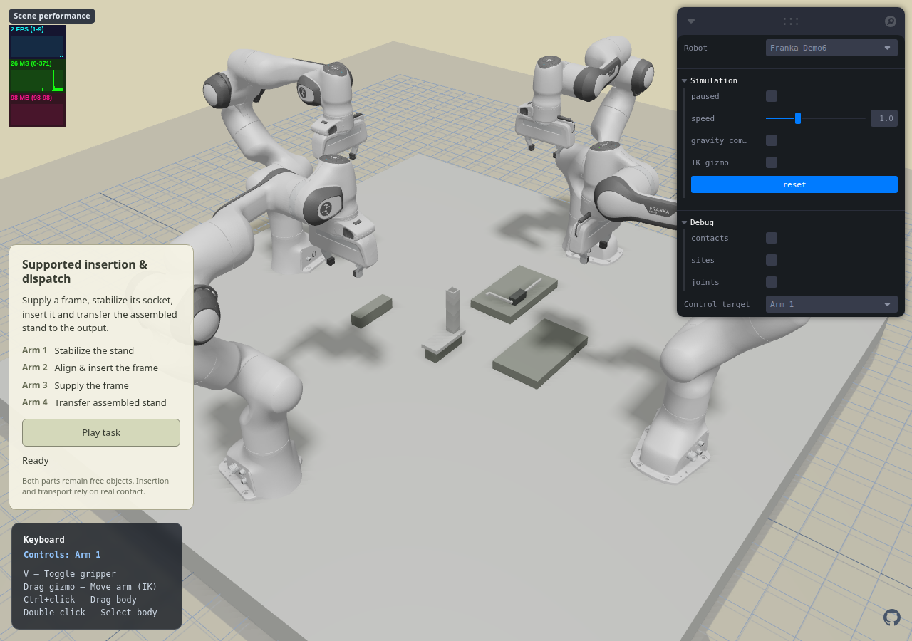
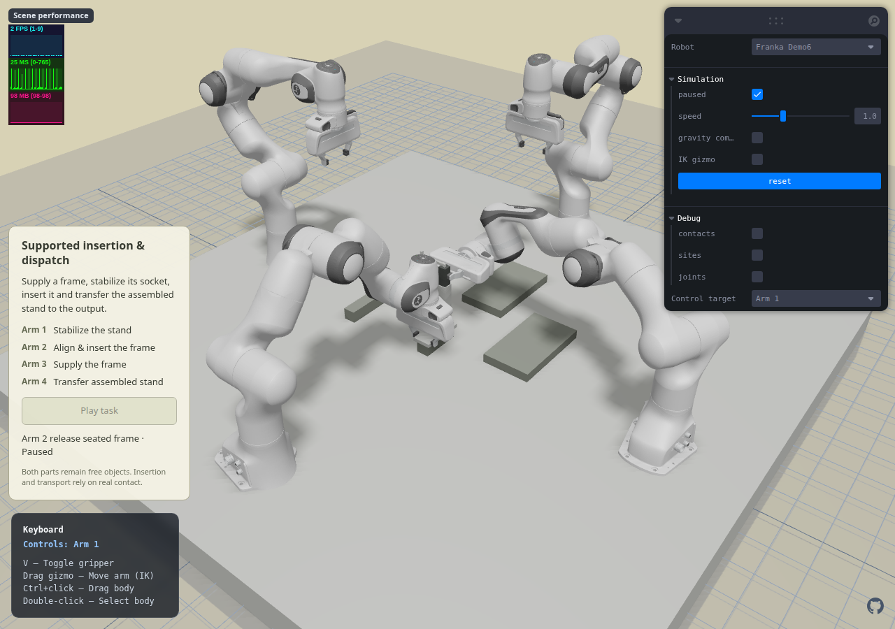
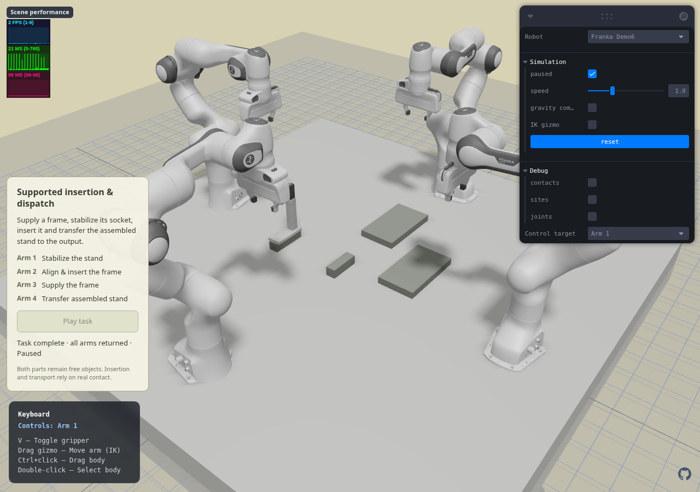

# Franka Demo6 — supported insertion and dispatch

## Authorization and preceding release

The user requested publishing the accepted work, then continuing the next task.
Demo3/4/5 were fast-forwarded to `main` and pushed at `f3bc480` after a fresh
261/261 regression run, TypeScript and production build. The Pages deployment
[37576485714](https://github.com/Shuaijun-LIU/web-robot-example-0/actions/runs/37576485714)
succeeded. Demo6 is new local work on `feat/franka-supported-insertion` and is
not part of that release.

## Design and source assets

- [Spec](../superpowers/specs/2026-10-07-supported-insertion-design.md)
- [Plan](../superpowers/plans/2026-10-07-supported-insertion.md)
- Candidate B from the [task proposals](../../project/benchmark-task-proposals-2026-10-07.md).
- Use existing robosuite 1.5.2 `StandWithMount` and `HookFrame` constructors,
  exported as MJCF with their visual/collision pairs and a genuine four-wall
  socket. These are benchmark parameterized objects, not newly modeled meshes.
- Source reference: [HookFrame](https://github.com/ARISE-Initiative/robosuite/blob/master/robosuite/models/objects/composite/hook_frame.py),
  [ToolHang](https://github.com/ARISE-Initiative/robosuite/blob/master/robosuite/environments/manipulation/tool_hang.py).
  Constructors, generated originals, source hashes and MIT license are packaged
  in `public/assets/franka-cooperative/insertion-sources/` and its manifest.

Initial source parameters: stand 60 × 140 × 160 mm; outer socket 30 mm,
wall 4 mm, inner opening 22 mm; base thickness 12 mm. Frame 95 × 180 mm,
7.5 mm square rod, source box grip 25.4 × 25.4 × 63.5 mm. No optional cone tip.
Aluminium-equivalent density 2700 kg/m³, grip 1000 kg/m³ are simulation
assumptions, not measured hardware. Do not inherit the reference task's very
heavy base or its visual hole-cover square.

## Roles and action

Arm 3 moves the flat incoming insert onto the east staging pad. Arm 1 grasps
the front base edge of the free stand. Arm 2 regrips and rotates the insert,
aligns its actual tip with the socket, lowers it, verifies seated contact and
releases. Arm 1 releases after withdrawal. Arm 4 approaches from the west,
grasps the existing socket stem from its sides, and transfers the free assembled
stand onto a west output support; all robots finish HOME.

Table support is permitted. This demonstrates coordination and insertion;
single-arm alternatives remain useful later baselines.

## Physical safeguards

- Actuator-only robot control; both task objects have independent free joints.
- Source Panda finger joint couplings remain; no object weld or attachment.
- New `inserted` gate uses actual tip/mouth, insertion depth, lateral distance,
  axis alignment, actual pair contact and settled speed.
- Optional object quaternion preconditions reject manually rotated parts
  without moving them back by script.
- Optional `contactLimits` enforces ≤1 mm stand/insert penetration throughout
  approach, insertion and transport, in addition to existing robot safeguards.

## Progress and diagnoses

- Asset/schema tests observed RED before implementation. Five new tests now
  pass, including a real cavity-clearance/solid-wall negative test and stale
  same-center rotation. Existing cooperative tests pass in the 11-test focused
  run. Initial browser layout renders with zero warnings/errors.
- Corrected a test assumption: four equality constraints belong to the four
  Panda finger-joint couplings, not object welds. The test checks equality type
  and independent free task joints instead of incorrectly requiring zero.
- Initial grasp closed along the long direction of the source handle; one
  finger hit the frame crossbar and the bilateral gate correctly rejected it.
  Panda jaws translate along local Y, so the source short-width grip needs
  a ±90-degree yaw. The first symmetric branch reached joint 7's limit; an
  offline IK branch probe selects the equivalent non-wrapping branch (Arm 1
  +90°, Arm 3 -90°). Supply, stand stabilization and Arm 2 pickup/lift pass.
- Direct flat-to-upright rotation with the L pointing north hits joint 5 for
  both jaw-equivalent grips at four sampled heights. An offline pose scan finds
  west/east pointing branches reachable at all four heights. Use the west-facing
  L, leaving the socket opening and Arm 1's front-base grasp unobstructed.
- Only Demo6's base ring is reduced from 0.78 to 0.75 m to bring the central
  horizontal-wrist insertion corridor within reach. Moving the stand east
  instead helped Arm 2 but made the original Arm 4 approach unreachable.
- Arm 2's long horizontal withdrawal also exceeded its reachable corridor;
  use a 40 mm axial withdrawal followed by a 160 mm move toward its own side.
- Arm 4's top-down approach to the base collides with the inserted frame.
  Tilting the wrist avoids that collision but gripping the thin front edge
  tips the loaded stand. Instead grasp the existing vertical socket stem
  from the west, with jaws closing across its 30 mm width; no added fixture.
  A 60 mm initial lift clears the support while staying within wrist limits.
- Direct Arm 4 joint-space HOME after placement disturbed the overhanging
  frame. A long horizontal withdrawal exceeded the folded wrist's reach;
  the verified retreat goes 60 mm west/80 mm down, 180 mm south, then 220 mm
  up outside the assembly before HOME. Nominal native/WASM runs record zero
  unintended robot penetration across the complete corrected motion.

## Physical acceptance

The complete program has 46 phases and 91.8 seconds of commanded motion
(native report time includes the initial one-second settling interval).

| Evidence | Native 3.3.7 | WASM 3.3.8 | WASM + 3 s initial settling |
|---|---:|---:|---:|
| Completed phases | 46 | 46 | 46 |
| Peak unintended robot penetration | 0 mm | 0 mm | 0 mm |
| Peak grip penetration | 0.05881 mm | 0.05881 mm | 0.05881 mm |
| Peak socket/insert penetration | 0.05035 mm | 0.05035 mm | 0.05555 mm |
| Final inserted depth | 107.0003 mm | 107.0003 mm | 107.0003 mm |
| Final lateral offset | 0.2335 mm | 0.2335 mm | 0.2165 mm |

The WASM test checks relative insertion geometry every 2 ms from unsupported
assembly verification through dispatch and HOME: 15,601 samples, maximum
lateral offset 0.350 mm nominal / 0.365 mm delayed. Insert and stand are released,
the stand has actual output-pad contact, and all four robots finish HOME.

During output release the solver reports two isolated 2-ms samples with no
socket contact: the seated shoulder briefly bounces by at most 19 µm nominal /
31 µm delayed. These samples remain recorded, not hidden. The rod stays deeply
inside the cavity throughout; geometric retention does not require a literally
unbroken contact manifold. Settled phase/final gates still require actual contact
and low speed, unchanged from the specification.

Reports: [native](../../artifacts/reports/cooperative-insertion-native.json),
[WASM](../../artifacts/reports/cooperative-insertion-wasm.json),
[delayed start](../../artifacts/reports/cooperative-insertion-wasm-extra-settle-1500.json).
The [actual browser run](../../artifacts/reports/cooperative-insertion-browser.json)
also completes all 46 phases. Pause freezes the task clock; Reset clears its
controller, and switching Demo6 → Demo5 → Demo6 reloads successfully. Browser
errors and MuJoCo warning counters are zero both before Reset and after reload.
The browser uses the real fixed-step physics/provider; software rendering affects
wall-clock speed, not task-body state or simulation acceptance. Final full
regression passes **268/268** in 311.291 seconds; TypeScript and production
build pass. Vite retains the existing dependency-externalization/large-chunk
warnings. Authored files pass whitespace checks; the byte-preserved upstream
robosuite license retains its two original trailing spaces.

The user subsequently requested **commit and publication of Demo6**. This
milestone is included in that release; select **Franka Demo6**, then **Play task**.
The default entry remains Demo1. The following Demo7 is a separate development
milestone, not included as a functioning page in this release.
Earlier failed retreat diagnostics were moved to the ignored local execution
ledger for recovery; they were not deleted or presented as current failures.

### Visual evidence

Initial layout:



Seated insert before the insertion arm releases:



Completed assembly on the west output support, all arms HOME:



## Independent review and follow-up fixes

- Important: end-of-phase checks alone did not prove continuous seating during
  transport. Added the per-tick geometric retention assertions and min/max
  evidence above; absolute motion speed is deliberately not a transport gate.
- Minor: penetration errors could rethrow while collecting failure diagnostics.
  `failure_snapshot` now reads raw contacts without re-entering the guard; an
  actual wall-penetration negative probe verifies the report stays serializable.
- Minor: added actual WASM observations for shallow, laterally offset,
  unsupported and supported poses, including a rotated stand coordinate frame.
- Reviewer did not judge unfinished browser/full-suite evidence or final visuals;
  these remain the implementer's explicit acceptance checks. Hardware behavior,
  training/generalization and four-arm necessity are outside this controlled
  demonstration, and are not claimed.

## Reproduction

Use Python with the recorded robosuite source package installed for asset export:

```bash
python scripts/build-insertion-assets.py
uv run --with 'mujoco==3.3.7' --with numpy python scripts/solve-insertion-task.py
node --test test/insertion-gates.test.mjs test/insertion-workcell.test.mjs test/insertion-wasm.test.mjs
node scripts/verify-insertion-browser.mjs
```

Browser verification uses software rendering and the local development URL
selected by `SCENE_URL` (default port 4185). Source visual/collision geometry,
tests and design records are local; randomized task distributions and model
training remain subsequent work.
